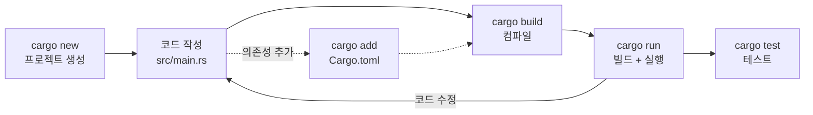

<figure class="post-figure post-figure--header">
<svg role="img" aria-label="Rust 기초의 한 장 요약 그림. 위쪽 띠는 개발 환경의 토대로, 왼쪽부터 rustup(툴체인 관리자) → cargo(빌드·패키지 시스템) → rustc(컴파일러) → 실행 파일로 이어지는 화살표 흐름을 보여준다. 아래쪽에는 이 글이 익히는 기본 문법 네 기둥이 카드로 놓여 있다: 변수와 가변성(let / let mut), 데이터 타입(스칼라·복합), 함수(fn, 반환), 흐름 제어(if / loop / for)." viewBox="0 0 680 300" xmlns="http://www.w3.org/2000/svg">
  <title>Rust 기초 — 환경의 토대(rustup→cargo→rustc→실행 파일)와 기본 문법 네 기둥(변수·타입·함수·흐름 제어)</title>

  <!-- ===== TOP: toolchain pipeline ===== -->
  <text x="340" y="24" text-anchor="middle" font-size="12" fill="currentColor" font-weight="700" opacity="0.75">개발 환경의 토대</text>

  <!-- rustup -->
  <rect x="24" y="40" width="118" height="56" rx="4" fill="var(--bg-light)" stroke="var(--accent-color)" stroke-width="2"/>
  <text x="83" y="64" text-anchor="middle" font-size="12" fill="currentColor" font-weight="700">rustup</text>
  <text x="83" y="82" text-anchor="middle" font-size="8.5" fill="currentColor" opacity="0.8">툴체인 관리자</text>
  <line x1="142" y1="68" x2="178" y2="68" stroke="var(--secondary-color)" stroke-width="2.5" marker-end="url(#rs-arrow)"/>

  <!-- cargo -->
  <rect x="180" y="40" width="118" height="56" rx="4" fill="var(--bg-light)" stroke="var(--accent-color)" stroke-width="2"/>
  <text x="239" y="64" text-anchor="middle" font-size="12" fill="currentColor" font-weight="700">cargo</text>
  <text x="239" y="82" text-anchor="middle" font-size="8.5" fill="currentColor" opacity="0.8">빌드·패키지</text>
  <line x1="298" y1="68" x2="334" y2="68" stroke="var(--secondary-color)" stroke-width="2.5" marker-end="url(#rs-arrow)"/>

  <!-- rustc -->
  <rect x="336" y="40" width="118" height="56" rx="4" fill="var(--bg-light)" stroke="currentColor" stroke-width="1.8"/>
  <text x="395" y="64" text-anchor="middle" font-size="12" fill="currentColor" font-weight="700">rustc</text>
  <text x="395" y="82" text-anchor="middle" font-size="8.5" fill="currentColor" opacity="0.8">컴파일러</text>
  <line x1="454" y1="68" x2="490" y2="68" stroke="var(--secondary-color)" stroke-width="2.5" marker-end="url(#rs-arrow)"/>

  <!-- binary -->
  <rect x="492" y="40" width="164" height="56" rx="4" fill="var(--bg-panel)" stroke="var(--gold)" stroke-width="2.5"/>
  <text x="574" y="64" text-anchor="middle" font-size="12" fill="currentColor" font-weight="700">실행 파일</text>
  <text x="574" y="82" text-anchor="middle" font-size="8.5" fill="currentColor" opacity="0.8">Hello, world!</text>

  <!-- divider -->
  <line x1="24" y1="124" x2="656" y2="124" stroke="currentColor" stroke-width="1" opacity="0.25"/>

  <!-- ===== BOTTOM: four syntax pillars ===== -->
  <text x="340" y="152" text-anchor="middle" font-size="12" fill="currentColor" font-weight="700" opacity="0.75">기본 문법 네 기둥</text>

  <!-- pillar 1: variables -->
  <rect x="24" y="168" width="150" height="100" rx="4" fill="var(--bg-light)" stroke="currentColor" stroke-width="1.8"/>
  <text x="99" y="192" text-anchor="middle" font-size="11" fill="currentColor" font-weight="700">변수·가변성</text>
  <text x="99" y="216" text-anchor="middle" font-size="9.5" fill="currentColor" opacity="0.85">let — 불변</text>
  <text x="99" y="234" text-anchor="middle" font-size="9.5" fill="var(--accent-color)" font-weight="700">let mut — 가변</text>
  <text x="99" y="254" text-anchor="middle" font-size="8" fill="currentColor" opacity="0.7">기본은 immutable</text>

  <!-- pillar 2: types -->
  <rect x="186" y="168" width="150" height="100" rx="4" fill="var(--bg-light)" stroke="currentColor" stroke-width="1.8"/>
  <text x="261" y="192" text-anchor="middle" font-size="11" fill="currentColor" font-weight="700">데이터 타입</text>
  <text x="261" y="216" text-anchor="middle" font-size="9.5" fill="currentColor" opacity="0.85">스칼라: i32·f64·bool·char</text>
  <text x="261" y="234" text-anchor="middle" font-size="9.5" fill="currentColor" opacity="0.85">복합: tuple·array</text>
  <text x="261" y="254" text-anchor="middle" font-size="8" fill="currentColor" opacity="0.7">정적 타입 + 추론</text>

  <!-- pillar 3: functions -->
  <rect x="348" y="168" width="150" height="100" rx="4" fill="var(--bg-light)" stroke="currentColor" stroke-width="1.8"/>
  <text x="423" y="192" text-anchor="middle" font-size="11" fill="currentColor" font-weight="700">함수</text>
  <text x="423" y="216" text-anchor="middle" font-size="9.5" fill="currentColor" opacity="0.85">fn add(x, y) -&gt; i32</text>
  <text x="423" y="234" text-anchor="middle" font-size="9.5" fill="currentColor" opacity="0.85">표현식 = 반환값</text>
  <text x="423" y="254" text-anchor="middle" font-size="8" fill="currentColor" opacity="0.7">세미콜론 없으면 반환</text>

  <!-- pillar 4: control flow -->
  <rect x="510" y="168" width="146" height="100" rx="4" fill="var(--bg-light)" stroke="var(--gold)" stroke-width="2"/>
  <text x="583" y="192" text-anchor="middle" font-size="11" fill="currentColor" font-weight="700">흐름 제어</text>
  <text x="583" y="216" text-anchor="middle" font-size="9.5" fill="currentColor" opacity="0.85">if — 표현식</text>
  <text x="583" y="234" text-anchor="middle" font-size="9.5" fill="currentColor" opacity="0.85">loop · while · for</text>
  <text x="583" y="254" text-anchor="middle" font-size="8" fill="currentColor" opacity="0.7">break로 값 반환</text>

  <defs>
    <marker id="rs-arrow" markerWidth="8" markerHeight="8" refX="6" refY="4" orient="auto">
      <path d="M0,0 L8,4 L0,8 z" fill="var(--secondary-color)"/>
    </marker>
  </defs>
</svg>
<figcaption>이 글의 한 장 요약 — 위쪽은 <strong>개발 환경의 토대</strong>(rustup으로 툴체인을 깔고 → cargo가 빌드·패키지를 묶고 → rustc가 컴파일해 → 실행 파일이 나옴), 아래쪽은 이 글에서 익히는 <strong>기본 문법 네 기둥</strong>(변수·가변성, 데이터 타입, 함수, 흐름 제어).</figcaption>
</figure>

## 들어가며

Rust 학습 로드맵의 첫 번째 단계인 기초 문법과 환경 설정에 대해 다룹니다. Rust를 시작하기 위해 필요한 도구를 설치하고, 간단한 프로그램을 작성하며 언어의 기본적인 구성 요소를 익혀봅시다.

## 1. Rust 설치 및 환경 설정

Rust를 설치하는 가장 표준적인 방법은 `rustup` 도구를 사용하는 것입니다. `rustup`은 Rust 버전 관리 및 툴체인 설치를 담당합니다.

### 설치 (macOS/Linux)

터미널에서 다음 명령어를 실행합니다.

```bash
curl --proto '=https' --tlsv1.2 -sSf https://sh.rustup.rs | sh
```

설치가 완료되면 쉘을 재시작하거나 환경 변수를 로드해야 합니다.

```bash
source $HOME/.cargo/env
```

### 설치 확인

설치가 정상적으로 되었는지 확인합니다.

```bash
rustc --version
cargo --version
```

- `rustc`: Rust 컴파일러
- `cargo`: Rust의 패키지 관리자이자 빌드 시스템

## 2. Hello World와 Cargo

Rust 생태계에서 `cargo`는 프로젝트 생성, 의존성 관리, 빌드, 테스트 등을 수행하는 핵심 도구입니다.

### 프로젝트 생성

`cargo`를 사용하여 새 프로젝트를 생성합니다.

```bash
cargo new hello_rust
cd hello_rust
```

### 디렉토리 구조

생성된 프로젝트의 구조는 다음과 같습니다.

```
hello_rust
├── Cargo.toml
└── src
    └── main.rs
```

- **Cargo.toml**: 프로젝트의 메타데이터와 의존성(dependencies)을 정의하는 파일입니다. (Node.js의 `package.json`과 유사)
- **src/main.rs**: 소스 코드 파일입니다.

### 실행

`src/main.rs`에는 기본적으로 Hello World 코드가 작성되어 있습니다.

```rust
fn main() {
    println!("Hello, world!");
}
```

프로젝트를 빌드하고 실행하려면 다음 명령어를 사용합니다.

```bash
cargo run
```

`cargo`를 중심으로 한 개발 사이클은 다음과 같이 돌아갑니다. 한 도구가 프로젝트 생성부터 빌드·실행·테스트·의존성 추가까지 전 과정을 일관되게 묶어줍니다.



## 3. 기본 문법

### 변수와 가변성 (Variables and Mutability)

Rust의 변수는 기본적으로 **불변(immutable)**입니다. 값을 변경하려면 `mut` 키워드를 사용해야 합니다.

```rust
fn main() {
    let x = 5;
    println!("The value of x is: {x}");
    // x = 6; // 컴파일 에러 발생! 불변 변수에 값을 재할당할 수 없음

    let mut y = 5;
    println!("The value of y is: {y}");
    y = 6; // 가능
    println!("The value of y is: {y}");
}
```

### 데이터 타입 (Data Types)

Rust는 정적 타입 언어이지만, 컴파일러가 타입을 추론할 수 있는 경우가 많습니다.

- **스칼라 타입**: 정수형(Integer), 부동소수점(Float), 불리언(Boolean), 문자(Char)
- **복합 타입**: 튜플(Tuple), 배열(Array)

### 함수 (Functions)

`fn` 키워드로 함수를 선언합니다. 매개변수의 타입과 반환 타입을 명시해야 합니다.

```rust
fn main() {
    let result = add(5, 10);
    println!("Result: {result}");
}

fn add(x: i32, y: i32) -> i32 {
    x + y // 세미콜론이 없으면 표현식(Expression)으로 간주되어 반환값이 됨
}
```

### 흐름 제어 (Control Flow)

#### if 표현식

```rust
fn main() {
    let number = 3;

    if number < 5 {
        println!("condition was true");
    } else {
        println!("condition was false");
    }

    // if는 표현식이므로 변수에 할당 가능
    let condition = true;
    let number = if condition { 5 } else { 6 };
}
```

#### 반복문 (Loop, While, For)

- **loop**: 무한 루프
- **while**: 조건부 루프
- **for**: 컬렉션 순회

```rust
fn main() {
    // loop
    let mut counter = 0;
    let result = loop {
        counter += 1;
        if counter == 10 {
            break counter * 2; // 값을 반환하며 루프 종료
        }
    };

    // while
    let mut number = 3;
    while number != 0 {
        println!("{number}!");
        number -= 1;
    }

    // for
    let a = [10, 20, 30, 40, 50];
    for element in a {
        println!("the value is: {element}");
    }

    // Range 사용
    for number in (1..4).rev() {
        println!("{number}!");
    }
}
```

## 마무리

이번 글에서는 Rust 개발 환경을 설정하고, 가장 기초적인 문법 요소들을 살펴보았습니다. 다음 단계에서는 Rust의 가장 독특하고 중요한 특징인 **소유권(Ownership)** 시스템에 대해 깊이 있게 다뤄보겠습니다.
