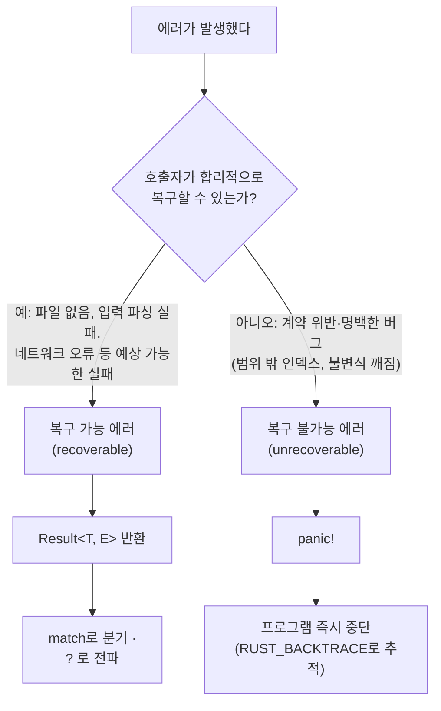

<figure class="post-figure post-figure--header">
<svg role="img" aria-label="Rust 에러 처리와 컬렉션을 한 장으로 묶은 그림. 왼쪽은 에러 처리 모델로, Result(T, E)가 성공 Ok(T)와 실패 Err(E)의 두 갈래로 갈리고, Ok에서는 값을 꺼내 계속 진행하며 Err에서는 ? 연산자가 호출자에게 에러를 조기 전파한다. 그 아래에는 복구 불가능한 panic!이 프로그램을 즉시 중단시키는 모습을 X 표시로 나타낸다. 오른쪽은 세 가지 핵심 컬렉션으로, Vec은 칸이 이어진 동적 배열, String은 UTF-8 바이트가 이어진 소유 문자열, HashMap은 키에서 값으로 이어지는 매핑으로 그려진다." viewBox="0 0 680 300" xmlns="http://www.w3.org/2000/svg">
  <title>Rust 에러 처리(Result의 Ok/Err 분기 · ? 전파 · panic!)와 핵심 컬렉션(Vec · String · HashMap)</title>

  <!-- ===== LEFT: error-handling model ===== -->
  <text x="170" y="24" text-anchor="middle" font-size="12" fill="currentColor" font-weight="700" opacity="0.75">에러 처리</text>

  <!-- a fallible call -->
  <rect x="40" y="48" width="96" height="30" rx="3" fill="var(--bg-light)" stroke="currentColor" stroke-width="1.8"/>
  <text x="88" y="67" text-anchor="middle" font-size="9" fill="currentColor" font-weight="700">실패할 수 있는 호출</text>

  <!-- Result<T, E> hub -->
  <rect x="48" y="92" width="80" height="30" rx="3" fill="var(--bg-panel)" stroke="var(--gold)" stroke-width="2"/>
  <text x="88" y="111" text-anchor="middle" font-size="9.5" fill="currentColor" font-weight="700">Result&lt;T, E&gt;</text>
  <line x1="88" y1="78" x2="88" y2="90" stroke="var(--secondary-color)" stroke-width="2" marker-end="url(#re-arrow)"/>

  <!-- branch to Ok -->
  <line x1="78" y1="122" x2="46" y2="150" stroke="var(--secondary-color)" stroke-width="2" marker-end="url(#re-arrow)"/>
  <rect x="14" y="152" width="68" height="44" rx="3" fill="var(--bg-light)" stroke="var(--accent-color)" stroke-width="2"/>
  <text x="48" y="170" text-anchor="middle" font-size="9.5" fill="currentColor" font-weight="700">Ok(T)</text>
  <text x="48" y="186" text-anchor="middle" font-size="8" fill="currentColor" opacity="0.8">값을 꺼냄</text>
  <line x1="48" y1="196" x2="48" y2="218" stroke="var(--secondary-color)" stroke-width="2" marker-end="url(#re-arrow)"/>
  <text x="48" y="234" text-anchor="middle" font-size="8.5" fill="currentColor" opacity="0.85" font-weight="700">계속 진행 ✓</text>

  <!-- branch to Err -->
  <line x1="98" y1="122" x2="130" y2="150" stroke="var(--secondary-color)" stroke-width="2" marker-end="url(#re-arrow)"/>
  <rect x="96" y="152" width="68" height="44" rx="3" fill="var(--bg-light)" stroke="currentColor" stroke-width="1.8"/>
  <text x="130" y="170" text-anchor="middle" font-size="9.5" fill="currentColor" font-weight="700">Err(E)</text>
  <text x="130" y="186" text-anchor="middle" font-size="8" fill="currentColor" opacity="0.8">? 로 전파</text>
  <line x1="164" y1="174" x2="196" y2="174" stroke="var(--accent-color)" stroke-width="2" marker-end="url(#re-arrow)"/>
  <text x="218" y="170" text-anchor="middle" font-size="8.5" fill="currentColor" opacity="0.85" font-weight="700">호출자에게</text>
  <text x="218" y="182" text-anchor="middle" font-size="8.5" fill="currentColor" opacity="0.85" font-weight="700">조기 반환</text>

  <!-- panic! -->
  <rect x="14" y="252" width="150" height="30" rx="3" fill="var(--bg-panel)" stroke="var(--accent-color)" stroke-width="2"/>
  <text x="66" y="271" text-anchor="middle" font-size="9.5" fill="currentColor" font-weight="700">panic!</text>
  <text x="128" y="271" text-anchor="middle" font-size="8" fill="currentColor" opacity="0.8">즉시 중단 ✕</text>

  <!-- divider -->
  <line x1="262" y1="40" x2="262" y2="288" stroke="currentColor" stroke-width="1" opacity="0.25"/>

  <!-- ===== RIGHT: collections ===== -->
  <text x="470" y="24" text-anchor="middle" font-size="12" fill="currentColor" font-weight="700" opacity="0.75">핵심 컬렉션</text>

  <!-- Vec<T> -->
  <text x="290" y="58" font-size="9.5" fill="currentColor" font-weight="700">Vec&lt;T&gt;</text>
  <text x="290" y="71" font-size="7.5" fill="currentColor" opacity="0.7">동적 배열</text>
  <g>
    <rect x="370" y="46" width="26" height="26" rx="2" fill="var(--bg-light)" stroke="currentColor" stroke-width="1.6"/>
    <rect x="398" y="46" width="26" height="26" rx="2" fill="var(--bg-light)" stroke="currentColor" stroke-width="1.6"/>
    <rect x="426" y="46" width="26" height="26" rx="2" fill="var(--bg-light)" stroke="currentColor" stroke-width="1.6"/>
    <rect x="454" y="46" width="26" height="26" rx="2" fill="var(--bg-light)" stroke="var(--accent-color)" stroke-width="2" stroke-dasharray="3 2"/>
    <text x="383" y="63" text-anchor="middle" font-size="9" fill="currentColor">1</text>
    <text x="411" y="63" text-anchor="middle" font-size="9" fill="currentColor">2</text>
    <text x="439" y="63" text-anchor="middle" font-size="9" fill="currentColor">3</text>
    <text x="467" y="63" text-anchor="middle" font-size="11" fill="currentColor" opacity="0.6">+</text>
  </g>
  <text x="612" y="63" text-anchor="middle" font-size="7.5" fill="currentColor" opacity="0.7">push로 늘어남</text>

  <!-- String -->
  <text x="290" y="130" font-size="9.5" fill="currentColor" font-weight="700">String</text>
  <text x="290" y="143" font-size="7.5" fill="currentColor" opacity="0.7">UTF-8 소유</text>
  <g>
    <rect x="370" y="118" width="22" height="26" rx="2" fill="var(--bg-light)" stroke="currentColor" stroke-width="1.6"/>
    <rect x="392" y="118" width="22" height="26" rx="2" fill="var(--bg-light)" stroke="currentColor" stroke-width="1.6"/>
    <rect x="414" y="118" width="22" height="26" rx="2" fill="var(--bg-panel)" stroke="var(--gold)" stroke-width="1.8"/>
    <rect x="436" y="118" width="22" height="26" rx="2" fill="var(--bg-panel)" stroke="var(--gold)" stroke-width="1.8"/>
    <rect x="458" y="118" width="22" height="26" rx="2" fill="var(--bg-panel)" stroke="var(--gold)" stroke-width="1.8"/>
    <text x="381" y="135" text-anchor="middle" font-size="8" fill="currentColor">h</text>
    <text x="403" y="135" text-anchor="middle" font-size="8" fill="currentColor">i</text>
    <text x="447" y="135" text-anchor="middle" font-size="7.5" fill="currentColor" font-weight="700">안</text>
  </g>
  <text x="612" y="135" text-anchor="middle" font-size="7.5" fill="currentColor" opacity="0.7">1자 = 여러 바이트</text>

  <!-- HashMap<K, V> -->
  <text x="290" y="208" font-size="9.5" fill="currentColor" font-weight="700">HashMap</text>
  <text x="290" y="221" font-size="7.5" fill="currentColor" opacity="0.7">키→값</text>
  <g>
    <rect x="370" y="190" width="60" height="24" rx="3" fill="var(--bg-light)" stroke="currentColor" stroke-width="1.6"/>
    <text x="400" y="206" text-anchor="middle" font-size="8.5" fill="currentColor" font-weight="700">"Blue"</text>
    <line x1="430" y1="202" x2="468" y2="202" stroke="var(--secondary-color)" stroke-width="2" marker-end="url(#re-arrow)"/>
    <rect x="470" y="190" width="44" height="24" rx="3" fill="var(--bg-panel)" stroke="var(--accent-color)" stroke-width="2"/>
    <text x="492" y="206" text-anchor="middle" font-size="9" fill="currentColor" font-weight="700">10</text>

    <rect x="370" y="222" width="60" height="24" rx="3" fill="var(--bg-light)" stroke="currentColor" stroke-width="1.6"/>
    <text x="400" y="238" text-anchor="middle" font-size="8.5" fill="currentColor" font-weight="700">"Red"</text>
    <line x1="430" y1="234" x2="468" y2="234" stroke="var(--secondary-color)" stroke-width="2" marker-end="url(#re-arrow)"/>
    <rect x="470" y="222" width="44" height="24" rx="3" fill="var(--bg-panel)" stroke="var(--accent-color)" stroke-width="2"/>
    <text x="492" y="238" text-anchor="middle" font-size="9" fill="currentColor" font-weight="700">50</text>
  </g>
  <text x="600" y="220" text-anchor="middle" font-size="7.5" fill="currentColor" opacity="0.7">get → Option&lt;&amp;V&gt;</text>

  <defs>
    <marker id="re-arrow" markerWidth="8" markerHeight="8" refX="6" refY="4" orient="auto">
      <path d="M0,0 L8,4 L0,8 z" fill="var(--secondary-color)"/>
    </marker>
  </defs>
</svg>
<figcaption>이 글의 한 장 요약 — 왼쪽은 <strong>에러 처리 모델</strong>: <code>Result&lt;T, E&gt;</code>가 <code>Ok(T)</code>(값을 꺼내 계속)와 <code>Err(E)</code>(<code>?</code>로 호출자에게 조기 전파)로 갈리고, 복구 불가능한 <code>panic!</code>은 프로그램을 즉시 중단합니다. 오른쪽은 <strong>핵심 컬렉션</strong>: <code>Vec</code>(동적 배열) · <code>String</code>(UTF-8 소유 문자열) · <code>HashMap</code>(키→값 매핑).</figcaption>
</figure>

## 들어가며

이번 글은 Rust Essential 로드맵의 4단계로, 실전에서 가장 자주 쓰는 표준 컬렉션과 견고한 에러 처리 방식을 다룹니다. 직전 글 [Rust 구조체, 열거형, 패턴 매칭](/2026/01/06/rust-structs-enums-pattern-matching.html)에서 익힌 `enum`과 `match`는 이번에 살펴볼 `Option`/`Result` 처리의 기반이 됩니다. 전체 학습 흐름은 [Rust Essential Curriculum](/2026/01/02/rust-essential-curriculum.html)에서 확인할 수 있습니다.

<div class="post-summary-box" markdown="1">

### 📌 이 글에서 다루는 내용

#### 🔍 핵심 주제

- **Collections**: `Vec<T>`, `String`, `HashMap<K, V>`의 생성·접근·순회
- **복구 가능한 에러**: `Result<T, E>`와 `match`, `unwrap`/`expect`
- **에러 전파**: `?` 연산자와 `panic!`의 차이

</div>

## Vec<T>: 동적 배열

`Vec<T>`는 같은 타입의 값을 힙에 연속으로 저장하는 가변 길이 배열입니다. `vec!` 매크로나 `Vec::new`으로 생성하고, `push`로 요소를 추가합니다.

```rust
fn main() {
    // 매크로로 초기값과 함께 생성
    let mut numbers = vec![1, 2, 3];

    // 빈 벡터 생성 후 push (타입 추론을 위해 push가 필요)
    let mut more: Vec<i32> = Vec::new();
    more.push(10);
    more.push(20);

    numbers.push(4); // [1, 2, 3, 4]
    println!("{:?}", numbers);
    println!("{:?}", more);
}
```

### 인덱싱(`[]`) vs `get`

인덱스 접근 `[]`는 범위를 벗어나면 `panic!`을 일으키지만, `get`은 `Option<&T>`를 반환해 안전하게 처리할 수 있습니다.

```rust
fn main() {
    let v = vec![10, 20, 30];

    let first = v[0]; // 직접 접근: 범위를 벗어나면 panic
    println!("first = {}", first);

    // get은 Option을 반환하므로 match로 안전하게 분기
    match v.get(10) {
        Some(value) => println!("value = {}", value),
        None => println!("해당 인덱스에 값이 없습니다"),
    }
}
```

### 순회와 `&mut` 순회

`for`로 불변 참조를 순회하거나, `&mut`로 각 요소를 직접 수정할 수 있습니다.

```rust
fn main() {
    let mut v = vec![100, 200, 300];

    // 불변 참조로 순회
    for n in &v {
        println!("{}", n);
    }

    // 가변 참조로 순회하며 값 수정 (역참조 * 필요)
    for n in &mut v {
        *n += 1;
    }
    println!("{:?}", v); // [101, 201, 301]
}
```

## String: 소유권 있는 UTF-8 문자열

`&str`은 문자열 슬라이스(주로 불변 참조)이고, `String`은 힙에 할당된 가변·소유 문자열입니다. 리터럴은 `&str`이며, `to_string`이나 `String::from`으로 `String`을 만듭니다.

```rust
fn main() {
    let literal: &str = "hello"; // 문자열 슬라이스
    let mut owned: String = literal.to_string(); // String으로 변환

    owned.push_str(", world"); // &str을 뒤에 이어붙임
    owned.push('!'); // 단일 문자 추가
    println!("{}", owned); // hello, world!
}
```

### `+`와 `format!`으로 결합

`+` 연산자는 왼쪽 `String`의 소유권을 가져가므로, 여러 문자열을 다룰 때는 `format!`이 더 편리하고 직관적입니다.

```rust
fn main() {
    let s1 = String::from("Rust");
    let s2 = String::from("Lang");

    // + 는 s1의 소유권을 가져가고, 오른쪽은 &str이어야 함
    let joined = s1 + &s2;
    println!("{}", joined); // RustLang

    // format!은 소유권을 가져가지 않아 안전하고 가독성이 좋음
    let a = String::from("Hello");
    let b = String::from("World");
    let msg = format!("{} {}", a, b);
    println!("{}", msg); // Hello World
}
```

### UTF-8 바이트 인덱싱 주의

`String`은 UTF-8로 인코딩되어 한 글자가 여러 바이트일 수 있습니다. 따라서 `s[0]`처럼 정수 인덱싱은 컴파일되지 않습니다. 문자 단위로 접근하려면 `chars`를, 바이트가 필요하면 슬라이스 범위를 사용합니다.

```rust
fn main() {
    let s = String::from("안녕");

    // let c = s[0]; // 컴파일 에러: String은 정수 인덱싱 불가

    // 문자 단위 순회
    for c in s.chars() {
        println!("{}", c);
    }

    println!("바이트 길이 = {}", s.len()); // 6 (한글 1자 = 3바이트)
}
```

## HashMap<K, V>: 키-값 매핑

`HashMap`은 키로 값을 조회하는 해시 테이블입니다. 표준 prelude에 없으므로 `use`로 가져와야 합니다.

```rust
use std::collections::HashMap;

fn main() {
    let mut scores = HashMap::new();
    scores.insert(String::from("Blue"), 10);
    scores.insert(String::from("Red"), 50);

    // get은 Option<&V>를 반환
    if let Some(score) = scores.get("Blue") {
        println!("Blue = {}", score);
    }

    // 키-값 쌍 순회 (순서는 보장되지 않음)
    for (team, score) in &scores {
        println!("{}: {}", team, score);
    }
}
```

### `entry().or_insert()` 패턴

키가 없을 때만 값을 넣고 싶을 때 `entry().or_insert()`가 유용합니다. 단어 빈도 계산 같은 누적 작업에서 자주 쓰입니다.

```rust
use std::collections::HashMap;

fn main() {
    let text = "the cat the dog the bird";
    let mut counts: HashMap<&str, i32> = HashMap::new();

    for word in text.split_whitespace() {
        // 키가 없으면 0을 넣고, 가변 참조를 반환받아 증가
        let count = counts.entry(word).or_insert(0);
        *count += 1;
    }

    println!("{:?}", counts); // {"the": 3, "cat": 1, "dog": 1, "bird": 1}
}
```

## panic!: 복구 불가능한 에러

`panic!`은 프로그램을 즉시 중단시키는 복구 불가능한 에러입니다. 잘못된 인덱스 접근이나 명백한 버그처럼 더 이상 진행할 수 없는 상황에서 발생합니다.

에러를 만났을 때 `panic!`으로 중단할지 `Result`로 돌려줄지는 다음 기준으로 가릅니다.



이 글의 나머지는 위 두 갈래 — 복구 불가능한 `panic!`과 복구 가능한 `Result` — 를 차례로 살펴봅니다.

```rust
fn main() {
    let v = vec![1, 2, 3];
    // 존재하지 않는 인덱스 접근 시 panic 발생
    println!("{}", v[99]);
}
```

`RUST_BACKTRACE=1` 환경 변수를 설정하면 패닉이 발생한 호출 스택을 추적할 수 있습니다.

```bash
RUST_BACKTRACE=1 cargo run
```

## Result<T, E>: 복구 가능한 에러

대부분의 실패는 복구 가능한 에러로 다뤄야 합니다. `Result<T, E>`는 성공 `Ok(T)`와 실패 `Err(E)` 두 변형을 가진 열거형이며, `match`로 분기합니다.

```rust
fn divide(a: i32, b: i32) -> Result<i32, String> {
    if b == 0 {
        Err(String::from("0으로 나눌 수 없습니다"))
    } else {
        Ok(a / b)
    }
}

fn main() {
    match divide(10, 2) {
        Ok(result) => println!("결과 = {}", result),
        Err(e) => println!("에러: {}", e),
    }

    match divide(10, 0) {
        Ok(result) => println!("결과 = {}", result),
        Err(e) => println!("에러: {}", e),
    }
}
```

### `unwrap`과 `expect`

`unwrap`은 `Ok` 값을 꺼내고, `Err`이면 패닉합니다. `expect`는 같은 동작이지만 패닉 메시지를 직접 지정할 수 있어 디버깅에 유리합니다.

```rust
fn main() {
    let ok: Result<i32, String> = Ok(5);
    let value = ok.unwrap(); // 5
    println!("{}", value);

    let parsed: i32 = "42".parse().expect("숫자 파싱에 실패했습니다");
    println!("{}", parsed); // 42
}
```

## ? 연산자: 에러 전파

`?` 연산자는 `Result`가 `Ok`면 값을 꺼내고, `Err`면 즉시 해당 에러를 함수의 반환값으로 전파합니다. 따라서 `?`를 쓰는 함수는 반드시 `Result`(또는 `Option`)를 반환해야 합니다.

```rust
use std::fs::File;
use std::io::{self, Read};

// 파일을 읽어 내용을 String으로 반환. 실패하면 io::Error를 전파
fn read_file(path: &str) -> Result<String, io::Error> {
    let mut file = File::open(path)?; // 열기 실패 시 Err 즉시 반환
    let mut contents = String::new();
    file.read_to_string(&mut contents)?; // 읽기 실패 시 Err 즉시 반환
    Ok(contents)
}

fn main() {
    match read_file("Cargo.toml") {
        Ok(text) => println!("{}", text),
        Err(e) => println!("파일 읽기 실패: {}", e),
    }
}
```

`?`가 없었다면 매번 `match`로 `Err`을 분기하고 `return`해야 하지만, `?` 한 글자로 같은 흐름을 간결하게 표현할 수 있습니다.

아래 그림은 `expr?` 한 표현이 `Ok`냐 `Err`이냐에 따라 어떻게 갈라지는지를 보여줍니다.

<figure class="post-figure">
<svg role="img" aria-label="? 연산자의 동작 흐름. 가운데 expr? 표현이 Result를 받아 두 갈래로 갈린다. 위쪽 Ok(value) 갈래에서는 value를 꺼내 다음 줄로 계속 진행하고, 아래쪽 Err(e) 갈래에서는 함수를 즉시 빠져나가 return Err(e)로 호출자에게 에러를 전파한다." viewBox="0 0 640 240" xmlns="http://www.w3.org/2000/svg">
  <title>? 연산자 — Ok면 값을 꺼내 계속, Err면 함수에서 즉시 return Err로 전파</title>

  <!-- expr? -->
  <rect x="32" y="98" width="120" height="44" rx="4" fill="var(--bg-panel)" stroke="var(--gold)" stroke-width="2"/>
  <text x="92" y="118" text-anchor="middle" font-size="13" fill="currentColor" font-weight="700">expr?</text>
  <text x="92" y="134" text-anchor="middle" font-size="8" fill="currentColor" opacity="0.8">Result&lt;T, E&gt;</text>

  <!-- split point -->
  <line x1="152" y1="120" x2="196" y2="120" stroke="var(--secondary-color)" stroke-width="2"/>
  <circle cx="200" cy="120" r="5" fill="none" stroke="currentColor" stroke-width="2"/>

  <!-- Ok branch (up) -->
  <line x1="204" y1="116" x2="248" y2="66" stroke="var(--secondary-color)" stroke-width="2" marker-end="url(#qm-arrow)"/>
  <text x="226" y="86" text-anchor="middle" font-size="9" fill="currentColor" font-weight="700" opacity="0.85">Ok(v)</text>
  <rect x="252" y="40" width="150" height="48" rx="4" fill="var(--bg-light)" stroke="var(--accent-color)" stroke-width="2"/>
  <text x="327" y="60" text-anchor="middle" font-size="10" fill="currentColor" font-weight="700">value(v)를 꺼냄</text>
  <text x="327" y="76" text-anchor="middle" font-size="8.5" fill="currentColor" opacity="0.8">표현식의 값이 됨</text>
  <line x1="402" y1="64" x2="446" y2="64" stroke="var(--secondary-color)" stroke-width="2" marker-end="url(#qm-arrow)"/>
  <rect x="450" y="40" width="160" height="48" rx="4" fill="var(--bg-light)" stroke="currentColor" stroke-width="1.8"/>
  <text x="530" y="60" text-anchor="middle" font-size="10" fill="currentColor" font-weight="700">다음 줄로 계속 ✓</text>
  <text x="530" y="76" text-anchor="middle" font-size="8.5" fill="currentColor" opacity="0.8">정상 경로</text>

  <!-- Err branch (down) -->
  <line x1="204" y1="124" x2="248" y2="174" stroke="var(--secondary-color)" stroke-width="2" marker-end="url(#qm-arrow)"/>
  <text x="226" y="166" text-anchor="middle" font-size="9" fill="currentColor" font-weight="700" opacity="0.85">Err(e)</text>
  <rect x="252" y="152" width="150" height="48" rx="4" fill="var(--bg-light)" stroke="currentColor" stroke-width="1.8"/>
  <text x="327" y="172" text-anchor="middle" font-size="10" fill="currentColor" font-weight="700">함수 즉시 탈출</text>
  <text x="327" y="188" text-anchor="middle" font-size="8.5" fill="currentColor" opacity="0.8">남은 줄은 실행 안 됨</text>
  <line x1="402" y1="176" x2="446" y2="176" stroke="var(--accent-color)" stroke-width="2" marker-end="url(#qm-arrow)"/>
  <rect x="450" y="152" width="160" height="48" rx="4" fill="var(--bg-panel)" stroke="var(--accent-color)" stroke-width="2"/>
  <text x="530" y="172" text-anchor="middle" font-size="10" fill="currentColor" font-weight="700">return Err(e)</text>
  <text x="530" y="188" text-anchor="middle" font-size="8.5" fill="currentColor" opacity="0.8">호출자에게 전파</text>

  <defs>
    <marker id="qm-arrow" markerWidth="8" markerHeight="8" refX="6" refY="4" orient="auto">
      <path d="M0,0 L8,4 L0,8 z" fill="var(--secondary-color)"/>
    </marker>
  </defs>
</svg>
<figcaption><code>?</code> 연산자의 두 갈래 — <code>Ok(v)</code>이면 안의 값 <code>v</code>를 꺼내 표현식의 값으로 삼아 그대로 진행하고, <code>Err(e)</code>이면 남은 줄을 건너뛰고 함수에서 즉시 <code>return Err(e)</code>로 호출자에게 에러를 전파합니다. 그래서 <code>?</code>를 쓰는 함수는 <code>Result</code>(또는 <code>Option</code>)를 반환해야 합니다.</figcaption>
</figure>

## 마무리

`Vec`, `String`, `HashMap`은 Rust 프로그래밍의 기본 도구이며, 접근 시 `Option`을 반환하는 API들은 안전한 코드를 자연스럽게 유도합니다. 에러 처리는 복구 불가능한 상황의 `panic!`과 복구 가능한 `Result`로 나뉘고, `?` 연산자를 통해 에러 전파를 간결하게 작성할 수 있습니다.

### 다음 학습

- [Rust 제네릭, 트레이트, 라이프타임](/2026/01/08/rust-generics-traits-lifetimes.html) — 컬렉션과 에러 타입을 더 일반화하는 방법
- [Rust Essential Curriculum](/2026/01/02/rust-essential-curriculum.html) — 전체 학습 로드맵
- 사용자 정의 에러 타입과 `Box<dyn Error>`를 활용한 유연한 에러 처리
