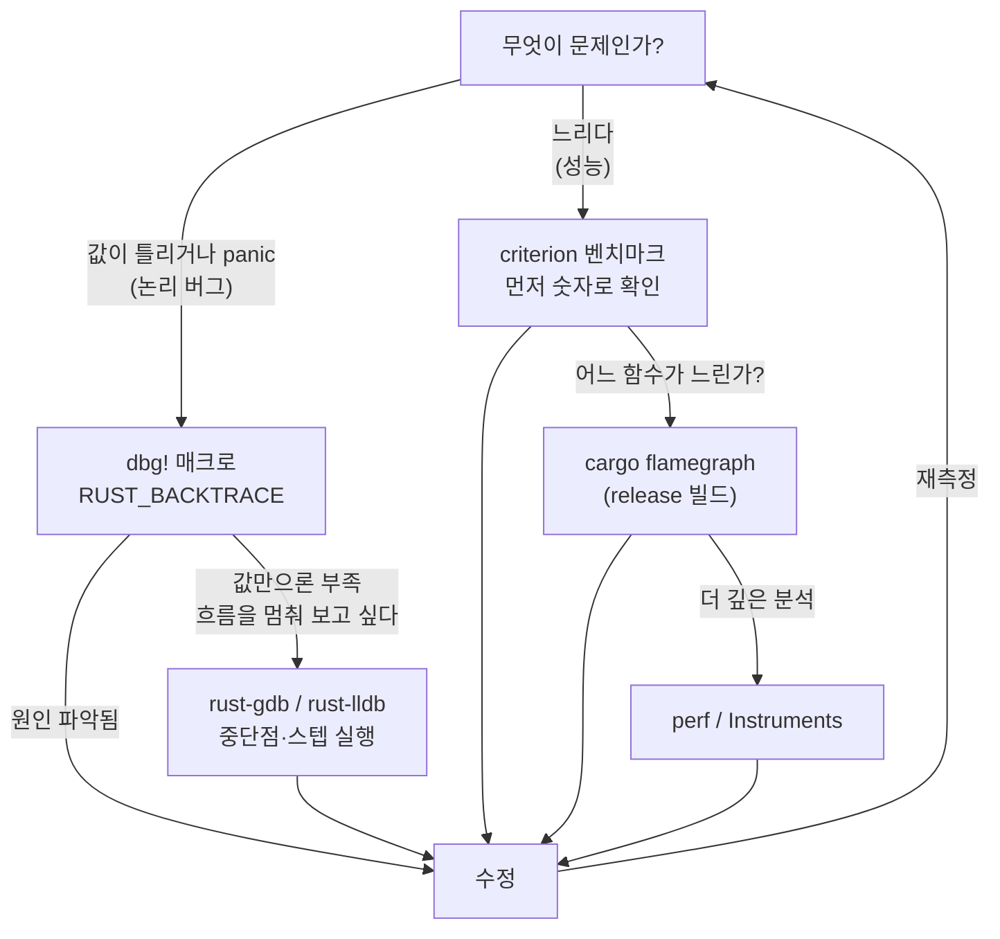

<figure class="post-figure post-figure--header">
<svg role="img" aria-label="Rust 코드를 추적하고 성능을 측정하는 순환 워크플로를 한 장에 담은 그림. 가운데를 시계 방향으로 도는 다섯 단계가 있다. 빌드에서 실행으로, 실행에서 문제 관측으로, 관측에서 원인 파악으로, 원인 파악에서 수정으로, 수정에서 다시 빌드로 화살표가 이어진다. 원인 파악 단계 옆에는 두 갈래 도구가 붙어 있는데, 위쪽 논리 버그 갈래에는 dbg! 매크로와 rust-gdb/rust-lldb 디버거가, 아래쪽 성능 갈래에는 criterion 벤치마크와 perf/flamegraph 프로파일러가 놓여 있다." viewBox="0 0 680 320" xmlns="http://www.w3.org/2000/svg">
  <title>Rust 디버깅·프로파일링 워크플로 — 빌드→실행→관측→원인 파악(디버거/프로파일러)→수정→재측정의 순환과 도구들</title>

  <!-- ===== LEFT: the cyclic workflow ===== -->
  <text x="160" y="24" text-anchor="middle" font-size="12" fill="currentColor" font-weight="700" opacity="0.75">측정-수정 순환</text>

  <!-- five stages around a ring (center 160,170 r=110) -->
  <!-- 1 빌드 (top) -->
  <rect x="120" y="48" width="80" height="34" rx="4" fill="var(--bg-light)" stroke="currentColor" stroke-width="1.8"/>
  <text x="160" y="69" text-anchor="middle" font-size="11" fill="currentColor" font-weight="700">빌드</text>
  <!-- 2 실행 (right) -->
  <rect x="232" y="120" width="80" height="34" rx="4" fill="var(--bg-light)" stroke="currentColor" stroke-width="1.8"/>
  <text x="272" y="141" text-anchor="middle" font-size="11" fill="currentColor" font-weight="700">실행</text>
  <!-- 3 문제 관측 (bottom-right) -->
  <rect x="196" y="232" width="96" height="34" rx="4" fill="var(--bg-light)" stroke="var(--accent-color)" stroke-width="2"/>
  <text x="244" y="253" text-anchor="middle" font-size="10.5" fill="currentColor" font-weight="700">문제 관측</text>
  <!-- 4 원인 파악 (bottom-left) -->
  <rect x="28" y="232" width="96" height="34" rx="4" fill="var(--bg-panel)" stroke="var(--gold)" stroke-width="2"/>
  <text x="76" y="253" text-anchor="middle" font-size="10.5" fill="currentColor" font-weight="700">원인 파악</text>
  <!-- 5 수정 (left) -->
  <rect x="8" y="120" width="80" height="34" rx="4" fill="var(--bg-light)" stroke="var(--secondary-color)" stroke-width="2"/>
  <text x="48" y="141" text-anchor="middle" font-size="11" fill="currentColor" font-weight="700">수정</text>

  <!-- clockwise arrows between stages -->
  <path d="M200,72 Q252,86 268,116" fill="none" stroke="var(--secondary-color)" stroke-width="2" marker-end="url(#dp-arrow)"/>
  <path d="M280,156 Q286,196 262,228" fill="none" stroke="var(--secondary-color)" stroke-width="2" marker-end="url(#dp-arrow)"/>
  <path d="M196,249 L128,249" fill="none" stroke="var(--secondary-color)" stroke-width="2" marker-end="url(#dp-arrow)"/>
  <path d="M58,230 Q40,196 46,156" fill="none" stroke="var(--secondary-color)" stroke-width="2" marker-end="url(#dp-arrow)"/>
  <path d="M70,118 Q92,84 118,74" fill="none" stroke="var(--secondary-color)" stroke-width="2" marker-end="url(#dp-arrow)"/>
  <!-- re-measure hint -->
  <text x="160" y="172" text-anchor="middle" font-size="9" fill="currentColor" opacity="0.6" font-weight="700">재측정</text>
  <text x="160" y="186" text-anchor="middle" font-size="8" fill="currentColor" opacity="0.55">until 충분히 정확·충분히 빠름</text>

  <!-- divider -->
  <line x1="356" y1="40" x2="356" y2="280" stroke="currentColor" stroke-width="1" opacity="0.25"/>

  <!-- ===== RIGHT: tools hanging off "원인 파악" ===== -->
  <text x="524" y="24" text-anchor="middle" font-size="12" fill="currentColor" font-weight="700" opacity="0.75">원인 파악 도구</text>

  <!-- branch label -->
  <rect x="384" y="56" width="124" height="28" rx="4" fill="var(--bg-panel)" stroke="var(--gold)" stroke-width="2"/>
  <text x="446" y="74" text-anchor="middle" font-size="9.5" fill="currentColor" font-weight="700">증상에 따라 갈래</text>

  <!-- logic-bug branch -->
  <line x1="446" y1="84" x2="446" y2="112" stroke="var(--secondary-color)" stroke-width="2"/>
  <line x1="446" y1="112" x2="404" y2="112" stroke="var(--secondary-color)" stroke-width="2" marker-end="url(#dp-arrow)"/>
  <text x="396" y="106" text-anchor="end" font-size="8.5" fill="currentColor" opacity="0.75" font-weight="700">논리 버그</text>
  <rect x="392" y="120" width="120" height="30" rx="3" fill="var(--bg-light)" stroke="currentColor" stroke-width="1.8"/>
  <text x="452" y="139" text-anchor="middle" font-size="9" fill="currentColor" font-weight="700">dbg! / backtrace</text>
  <rect x="392" y="156" width="120" height="30" rx="3" fill="var(--bg-light)" stroke="currentColor" stroke-width="1.8"/>
  <text x="452" y="175" text-anchor="middle" font-size="9" fill="currentColor" font-weight="700">rust-gdb / lldb</text>

  <!-- perf branch -->
  <line x1="446" y1="84" x2="446" y2="208" stroke="var(--secondary-color)" stroke-width="2"/>
  <line x1="446" y1="208" x2="404" y2="208" stroke="var(--secondary-color)" stroke-width="2" marker-end="url(#dp-arrow)"/>
  <text x="396" y="202" text-anchor="end" font-size="8.5" fill="currentColor" opacity="0.75" font-weight="700">성능</text>
  <rect x="392" y="216" width="120" height="30" rx="3" fill="var(--bg-light)" stroke="var(--accent-color)" stroke-width="2"/>
  <text x="452" y="235" text-anchor="middle" font-size="9" fill="currentColor" font-weight="700">criterion 벤치</text>
  <rect x="392" y="252" width="120" height="30" rx="3" fill="var(--bg-light)" stroke="var(--accent-color)" stroke-width="2"/>
  <text x="452" y="271" text-anchor="middle" font-size="9" fill="currentColor" font-weight="700">perf / flamegraph</text>

  <!-- second column: outputs / notes -->
  <g font-size="8.5">
    <rect x="524" y="120" width="132" height="30" rx="3" fill="var(--bg-panel)" stroke="currentColor" stroke-width="1.5"/>
    <text x="590" y="139" text-anchor="middle" fill="currentColor" font-weight="700">값·호출 스택 추적</text>
    <rect x="524" y="156" width="132" height="30" rx="3" fill="var(--bg-panel)" stroke="currentColor" stroke-width="1.5"/>
    <text x="590" y="175" text-anchor="middle" fill="currentColor" font-weight="700">중단점·스텝 실행</text>
    <rect x="524" y="216" width="132" height="30" rx="3" fill="var(--bg-panel)" stroke="currentColor" stroke-width="1.5"/>
    <text x="590" y="235" text-anchor="middle" fill="currentColor" font-weight="700">통계적 시간 측정</text>
    <rect x="524" y="252" width="132" height="30" rx="3" fill="var(--bg-panel)" stroke="currentColor" stroke-width="1.5"/>
    <text x="590" y="271" text-anchor="middle" fill="currentColor" font-weight="700">핫스팟 시각화 (release)</text>
  </g>
  <line x1="512" y1="135" x2="524" y2="135" stroke="currentColor" stroke-width="1.5" opacity="0.6"/>
  <line x1="512" y1="171" x2="524" y2="171" stroke="currentColor" stroke-width="1.5" opacity="0.6"/>
  <line x1="512" y1="231" x2="524" y2="231" stroke="currentColor" stroke-width="1.5" opacity="0.6"/>
  <line x1="512" y1="267" x2="524" y2="267" stroke="currentColor" stroke-width="1.5" opacity="0.6"/>

  <defs>
    <marker id="dp-arrow" markerWidth="8" markerHeight="8" refX="6" refY="4" orient="auto">
      <path d="M0,0 L8,4 L0,8 z" fill="var(--secondary-color)"/>
    </marker>
  </defs>
</svg>
<figcaption>이 글의 한 장 요약 — 왼쪽은 <strong>측정-수정 순환</strong>(빌드→실행→문제 관측→원인 파악→수정→재측정), 오른쪽은 <strong>원인 파악 도구</strong>가 증상에 따라 두 갈래로 갈리는 모습. 논리 버그는 <code>dbg!</code>·backtrace·<code>rust-gdb</code>/<code>lldb</code>로 값과 실행을 추적하고, 성능 문제는 <code>criterion</code>으로 측정하고 <code>perf</code>/flamegraph로 핫스팟을 찾는다.</figcaption>
</figure>

## 들어가며

이 글은 Rust-Essential 로드맵의 7단계로, 코드를 추적하고 성능을 측정하는 도구들을 다룹니다. 이전 단계인 [Rust 스마트 포인터, 동시성, 그리고 프로젝트](/2026/01/09/rust-smart-pointers-concurrency-and-projects.html)에서 만든 프로그램이 올바르게 동작하는지, 그리고 충분히 빠른지를 확인할 차례입니다. 전체 학습 경로는 [Rust Essential Curriculum](/2026/01/02/rust-essential-curriculum.html)에서 확인할 수 있습니다.

<div class="post-summary-box" markdown="1">

### 📌 이 글에서 다루는 내용

#### 🔍 핵심 주제

- **Debugging**: `dbg!` 매크로, `RUST_BACKTRACE`, `rust-gdb`/`rust-lldb` 연동
- **Benchmarking**: `criterion` 크레이트로 통계적 벤치마킹
- **Profiling**: `cargo-flamegraph`로 핫스팟 시각화, release 빌드의 중요성

</div>

## 디버깅

문제의 **증상**이 도구를 정합니다. 값이 이상하거나 panic이 나는 **논리 버그**라면 먼저 가벼운 추적(`dbg!`/backtrace)으로 시작해 필요할 때 디버거로 내려가고, "느리다"는 **성능 문제**라면 먼저 `criterion`으로 숫자를 확인한 뒤 flamegraph로 핫스팟을 찾습니다. 아래 흐름이 그 선택의 지도입니다.



### println!의 한계

가장 손쉬운 디버깅 방법은 `println!`이지만, 단점이 분명합니다. 표준 출력으로 나가기 때문에 프로그램의 정상 출력과 섞이고, 어느 파일·라인에서 찍은 값인지 직접 적어주지 않으면 알 수 없습니다. 또한 출력하려는 값이 `Display`를 구현하지 않으면 `{:?}`(Debug)을 따로 지정해야 합니다.

```rust
fn main() {
    let nums = vec![1, 2, 3];
    // 어디서 찍었는지, 무슨 값인지 직접 라벨을 달아야 한다
    println!("nums = {:?}", nums);
}
```

로그성 출력이라면 표준 에러로 보내는 `eprintln!`을 쓰는 편이 낫습니다. 정상 출력(stdout)과 진단 출력(stderr)을 분리할 수 있기 때문입니다.

```rust
fn main() {
    eprintln!("디버그 메시지는 stderr로"); // 파이프라인 출력과 섞이지 않는다
    println!("실제 결과는 stdout으로");
}
```

### dbg! 매크로

`dbg!` 매크로는 표현식을 출력하면서 **그 값을 그대로 반환**합니다. 파일명·라인 번호와 표현식 자체를 함께 stderr로 찍어주기 때문에 라벨을 직접 달 필요가 없습니다.

```rust
fn factorial(n: u64) -> u64 {
    // dbg!(n)은 n을 출력한 뒤 n 값을 그대로 돌려준다
    if dbg!(n) <= 1 {
        1
    } else {
        n * factorial(n - 1)
    }
}

fn main() {
    let result = dbg!(factorial(4)); // 중간 값과 최종 값을 모두 추적
    println!("결과: {}", result);
}
```

값을 반환하므로 표현식 중간에 끼워 넣어도 코드 흐름을 바꾸지 않습니다. 출력은 다음과 같은 형태로 나옵니다.

```bash
[src/main.rs:3:8] n = 4
[src/main.rs:3:8] n = 3
[src/main.rs:11:18] factorial(4) = 24
```

### RUST_BACKTRACE로 panic 추적

프로그램이 `panic`하면 기본적으로 한 줄짜리 메시지만 보입니다. `RUST_BACKTRACE=1` 환경 변수를 설정하면 패닉이 발생하기까지의 호출 스택 전체를 볼 수 있습니다.

```rust
fn main() {
    let v: Vec<i32> = vec![1, 2, 3];
    let _ = v[10]; // index out of bounds: panic 발생
}
```

```bash
# 백트레이스와 함께 실행
RUST_BACKTRACE=1 cargo run

# 더 자세한 프레임까지 보고 싶다면
RUST_BACKTRACE=full cargo run
```

### rust-gdb / rust-lldb로 디버거 연동

값 한두 개가 아니라 실행 흐름을 단계별로 멈춰가며 보고 싶을 때는 디버거를 씁니다. Rust는 `gdb`/`lldb`를 Rust 타입에 맞게 감싼 `rust-gdb`, `rust-lldb` 래퍼를 제공합니다. 이 래퍼들은 `Vec`, `String` 같은 타입을 사람이 읽기 좋은 형태로 보여줍니다.

debug 빌드에는 디버그 심볼이 기본 포함되므로, 그냥 `cargo build`로 만든 바이너리를 디버거에 넘기면 됩니다.

```bash
# debug 빌드 (심볼 포함)
cargo build

# Linux: gdb 래퍼로 실행
rust-gdb ./target/debug/myapp

# macOS: lldb 래퍼로 실행
rust-lldb ./target/debug/myapp
```

디버거 안에서는 중단점을 걸고 한 줄씩 실행하며 변수를 확인할 수 있습니다.

```bash
(gdb) break main.rs:3   # 3번 라인에 중단점
(gdb) run               # 실행
(gdb) print v           # 변수 v 출력
(gdb) next              # 다음 줄로
(gdb) continue          # 계속 진행
```

CLI가 부담스럽다면 VS Code에 **CodeLLDB** 확장을 설치해 GUI에서 중단점·변수 검사·스텝 실행을 그대로 사용할 수 있습니다. `launch.json`에 debug 빌드 바이너리를 지정하면 됩니다.

## 벤치마킹

"빠르다"는 느낌이 아니라 숫자로 확인하려면 벤치마킹이 필요합니다. `criterion` 크레이트는 여러 번 반복 측정해 통계적으로 신뢰할 수 있는 결과를 내고, 이전 실행과 비교해 성능 회귀까지 잡아줍니다.

먼저 `Cargo.toml`의 `[dev-dependencies]`에 `criterion`을 추가하고, 벤치 타깃을 등록합니다.

```toml
[dev-dependencies]
criterion = "0.5"

# benches/my_benchmark.rs 를 벤치 타깃으로 등록
[[bench]]
name = "my_benchmark"
harness = false
```

벤치 코드는 `benches/` 디렉토리에 둡니다. `black_box`는 컴파일러가 입력을 상수 폴딩으로 최적화해 없애버리지 않도록 막아주는 함수입니다.

```rust
// benches/my_benchmark.rs
use criterion::{black_box, criterion_group, criterion_main, Criterion};

fn fibonacci(n: u64) -> u64 {
    match n {
        0 => 0,
        1 => 1,
        n => fibonacci(n - 1) + fibonacci(n - 2),
    }
}

fn bench_fib(c: &mut Criterion) {
    // black_box로 입력 최적화를 방지
    c.bench_function("fib 20", |b| b.iter(|| fibonacci(black_box(20))));
}

criterion_group!(benches, bench_fib);
criterion_main!(benches);
```

`cargo bench`로 실행하면 평균 시간과 분포를 출력하고, `target/criterion/`에 HTML 리포트를 생성합니다.

```bash
cargo bench
```

## 프로파일링

벤치마킹이 "얼마나 빠른가"를 재는 것이라면, 프로파일링은 "어디서 시간을 쓰는가"를 찾는 작업입니다.

### release 빌드로 측정하는 이유

프로파일링은 반드시 release 빌드로 해야 합니다. debug 빌드는 최적화가 꺼져 있어(`-O0`) 실제 배포 바이너리와 성능 특성이 완전히 다르고, 인라이닝·루프 최적화가 적용되지 않아 핫스팟이 엉뚱하게 보입니다.

```bash
# 최적화가 적용된 release 빌드로 측정
cargo build --release
```

다만 release 빌드는 디버그 심볼을 빼버려 프로파일에서 함수 이름이 보이지 않을 수 있습니다. `Cargo.toml`에서 release 프로파일에 심볼을 다시 켜주면 됩니다.

```toml
# 최적화는 유지하면서 디버그 심볼만 추가
[profile.release]
debug = true
```

### cargo-flamegraph로 핫스팟 시각화

`flamegraph`는 호출 스택별로 소비한 시간을 가로 폭으로 보여주는 시각화입니다. 폭이 넓을수록 그 함수에서 시간을 많이 쓴 것이므로 최적화 대상을 한눈에 찾을 수 있습니다. `cargo-flamegraph`를 설치하면 한 명령으로 생성할 수 있습니다.

```bash
# 설치
cargo install flamegraph

# release 빌드로 실행하며 flamegraph.svg 생성
cargo flamegraph --release

# 인자가 필요한 바이너리라면 -- 뒤에 전달
cargo flamegraph --release -- --input data.txt
```

flamegraph는 한 번 읽는 법을 익히면 누적된 CPU 시간을 한눈에 보여줍니다. **가로 폭은 시간**(넓을수록 그 함수에서 오래 머묾), **세로 높이는 호출 스택 깊이**(위로 갈수록 더 안쪽에서 호출된 함수)입니다. 색은 보통 의미가 없고, **넓은 막대**가 최적화 대상이라는 점만 기억하면 됩니다.

<figure class="post-figure">
<svg role="img" aria-label="flamegraph를 읽는 법을 설명하는 도식. 아래쪽 넓은 막대 main에서 위로 갈수록 좁아지는 막대들이 쌓여 호출 스택을 이룬다. 가로축은 시간으로, 막대가 넓을수록 그 함수에서 보낸 누적 시간이 길다. 세로축은 스택 깊이로, 위로 갈수록 더 안쪽에서 호출된 함수다. 가장 넓은 상단 막대 parse가 최적화 대상으로 강조되어 있다." viewBox="0 0 640 300" xmlns="http://www.w3.org/2000/svg">
  <title>flamegraph 읽는 법 — 가로 폭=누적 시간, 세로 높이=호출 스택 깊이, 넓은 막대가 최적화 대상</title>

  <!-- axes labels -->
  <text x="320" y="22" text-anchor="middle" font-size="12" fill="currentColor" font-weight="700" opacity="0.8">가로 = 시간(누적), 세로 = 스택 깊이</text>

  <!-- vertical axis: stack depth -->
  <line x1="70" y1="60" x2="70" y2="248" stroke="currentColor" stroke-width="1.5" marker-end="url(#fg-up)"/>
  <text x="40" y="158" text-anchor="middle" font-size="10" fill="currentColor" font-weight="700" opacity="0.8" transform="rotate(-90 40 158)">스택 깊이 ↑</text>

  <!-- horizontal axis: time -->
  <line x1="70" y1="248" x2="612" y2="248" stroke="currentColor" stroke-width="1.5" marker-end="url(#fg-right)"/>
  <text x="340" y="276" text-anchor="middle" font-size="10" fill="currentColor" font-weight="700" opacity="0.8">시간(샘플 수) →</text>

  <!-- ===== flame bars (bottom = level 0, widest) ===== -->
  <!-- level 0: main spans full width -->
  <rect x="74" y="218" width="528" height="26" rx="2" fill="var(--bg-light)" stroke="currentColor" stroke-width="1.5"/>
  <text x="338" y="235" text-anchor="middle" font-size="10" fill="currentColor" font-weight="700">main  (100%)</text>

  <!-- level 1 -->
  <rect x="74" y="190" width="312" height="26" rx="2" fill="var(--bg-light)" stroke="currentColor" stroke-width="1.5"/>
  <text x="230" y="207" text-anchor="middle" font-size="9.5" fill="currentColor" font-weight="700">run</text>
  <rect x="388" y="190" width="214" height="26" rx="2" fill="var(--bg-light)" stroke="currentColor" stroke-width="1.5"/>
  <text x="495" y="207" text-anchor="middle" font-size="9.5" fill="currentColor" font-weight="700">flush</text>

  <!-- level 2 -->
  <rect x="74" y="162" width="252" height="26" rx="2" fill="var(--bg-panel)" stroke="var(--accent-color)" stroke-width="2.4"/>
  <text x="200" y="179" text-anchor="middle" font-size="9.5" fill="currentColor" font-weight="700">parse  ← 가장 넓음</text>
  <rect x="388" y="162" width="120" height="26" rx="2" fill="var(--bg-light)" stroke="currentColor" stroke-width="1.5"/>
  <text x="448" y="179" text-anchor="middle" font-size="9" fill="currentColor" font-weight="700">write</text>

  <!-- level 3 -->
  <rect x="74" y="134" width="150" height="26" rx="2" fill="var(--bg-light)" stroke="currentColor" stroke-width="1.5"/>
  <text x="149" y="151" text-anchor="middle" font-size="9" fill="currentColor" font-weight="700">tokenize</text>
  <rect x="228" y="134" width="98" height="26" rx="2" fill="var(--bg-light)" stroke="currentColor" stroke-width="1.5"/>
  <text x="277" y="151" text-anchor="middle" font-size="8.5" fill="currentColor" font-weight="700">alloc</text>

  <!-- callout for the widest top bar -->
  <line x1="200" y1="160" x2="200" y2="96" stroke="var(--accent-color)" stroke-width="1.6" stroke-dasharray="4 3"/>
  <rect x="120" y="64" width="300" height="30" rx="4" fill="var(--bg-panel)" stroke="var(--accent-color)" stroke-width="2"/>
  <text x="270" y="83" text-anchor="middle" font-size="9.5" fill="currentColor" font-weight="700">넓은 막대 = 시간을 많이 씀 → 최적화 1순위</text>

  <defs>
    <marker id="fg-up" markerWidth="8" markerHeight="8" refX="4" refY="2" orient="auto">
      <path d="M4,0 L8,8 L0,8 z" fill="currentColor"/>
    </marker>
    <marker id="fg-right" markerWidth="8" markerHeight="8" refX="6" refY="4" orient="auto">
      <path d="M0,0 L8,4 L0,8 z" fill="currentColor"/>
    </marker>
  </defs>
</svg>
<figcaption>flamegraph 읽는 법 — <strong>가로 폭은 누적 시간</strong>(넓을수록 그 함수에서 오래 머묾), <strong>세로 높이는 호출 스택 깊이</strong>(위로 갈수록 더 안쪽 호출). 아래 <code>main</code>은 전체의 100%를 차지하고, 그 위로 갈라진 막대 중 가장 넓은 <code>parse</code>가 최적화 1순위다. 색은 대개 의미 없고 폭만 본다.</figcaption>
</figure>

생성된 `flamegraph.svg`를 브라우저로 열면 넓은 막대(시간을 많이 쓴 함수)부터 살펴보며 최적화 우선순위를 정할 수 있습니다.

내부적으로 `cargo-flamegraph`는 **Linux에서는 `perf`**, **macOS에서는 `dtrace`/Instruments** 같은 OS 프로파일러를 호출합니다. 더 깊은 분석이 필요하면 Linux에서는 `perf record`/`perf report`를, macOS에서는 Xcode의 **Instruments**(Time Profiler)를 직접 사용해 CPU·메모리 동작을 자세히 들여다볼 수 있습니다.

## 마무리

`dbg!`와 `RUST_BACKTRACE`로 빠르게 값을 추적하고, 필요하면 `rust-gdb`/`rust-lldb`로 실행을 단계별로 멈춰 들여다봅니다. 성능은 느낌이 아니라 `criterion`으로 측정하고, `cargo flamegraph`로 핫스팟을 찾아 우선순위를 정합니다. 프로파일링은 항상 release 빌드로 한다는 원칙만 지키면 측정 자체가 거짓말을 하지 않습니다.

### 다음 학습

- [Rust로 하는 TDD](/2026/01/11/rust-tdd.html) — 테스트를 먼저 작성하며 안정적으로 코드를 키우는 방법
- `criterion`의 비교 모드로 성능 회귀를 자동 감지하기
- `perf`/Instruments로 캐시 미스·메모리 할당까지 파고들기
- [Rust Essential Curriculum](/2026/01/02/rust-essential-curriculum.html) — 전체 학습 로드맵 다시 보기
