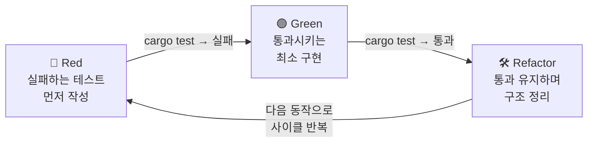

<figure class="post-figure post-figure--header">
<svg role="img" aria-label="TDD의 Red-Green-Refactor 사이클을 한 장으로 묶은 그림. 세 단계가 시계 방향 순환을 이룬다. 왼쪽 위 Red 단계에서는 아직 구현되지 않은 동작에 대한 실패하는 테스트를 먼저 작성해 cargo test가 빨간불(FAIL)을 낸다. 오른쪽 Green 단계에서는 테스트를 통과시키는 가장 단순한 코드를 작성해 초록불(ok)을 켠다. 아래쪽 Refactor 단계에서는 테스트가 통과하는 상태를 유지하며 중복을 제거하고 구조를 다듬는다. 화살표가 세 단계를 따라 다시 Red로 돌아오며 짧은 주기로 반복된다." viewBox="0 0 680 300" xmlns="http://www.w3.org/2000/svg">
  <title>Rust TDD — Red(실패 테스트 먼저) → Green(최소 구현으로 통과) → Refactor(통과 유지하며 정리)의 순환</title>

  <!-- ===== circular cycle arrows ===== -->
  <defs>
    <marker id="tdd-arrow" markerWidth="9" markerHeight="9" refX="6" refY="4.5" orient="auto">
      <path d="M0,0 L9,4.5 L0,9 z" fill="var(--secondary-color)"/>
    </marker>
  </defs>
  <text x="340" y="26" text-anchor="middle" font-size="13" fill="currentColor" font-weight="700" opacity="0.75">TDD 사이클 — 짧은 주기로 반복</text>

  <!-- cycle ring (three arcs between the stations) -->
  <!-- Red → Green (top, left to right) -->
  <path d="M 232 88 Q 340 56 448 88" fill="none" stroke="var(--secondary-color)" stroke-width="2.5" marker-end="url(#tdd-arrow)"/>
  <!-- Green → Refactor (right, down) -->
  <path d="M 506 132 Q 470 222 372 244" fill="none" stroke="var(--secondary-color)" stroke-width="2.5" marker-end="url(#tdd-arrow)"/>
  <!-- Refactor → Red (left, up) -->
  <path d="M 268 244 Q 170 222 134 132" fill="none" stroke="var(--secondary-color)" stroke-width="2.5" marker-end="url(#tdd-arrow)"/>

  <!-- ===== RED station ===== -->
  <rect x="58" y="80" width="160" height="84" rx="5" fill="var(--bg-light)" stroke="var(--accent-color)" stroke-width="2.5"/>
  <circle cx="86" cy="104" r="9" fill="none" stroke="var(--accent-color)" stroke-width="3"/>
  <text x="108" y="109" font-size="13" fill="currentColor" font-weight="700">1. Red</text>
  <text x="138" y="132" text-anchor="middle" font-size="9.5" fill="currentColor" opacity="0.85">실패하는 테스트를</text>
  <text x="138" y="146" text-anchor="middle" font-size="9.5" fill="currentColor" opacity="0.85">먼저 작성</text>
  <text x="138" y="160" text-anchor="middle" font-size="8.5" fill="var(--accent-color)" font-weight="700" font-family="monospace">cargo test … FAIL</text>

  <!-- ===== GREEN station ===== -->
  <rect x="462" y="80" width="160" height="84" rx="5" fill="var(--bg-light)" stroke="var(--secondary-color)" stroke-width="2.5"/>
  <circle cx="490" cy="104" r="9" fill="none" stroke="var(--secondary-color)" stroke-width="3"/>
  <text x="512" y="109" font-size="13" fill="currentColor" font-weight="700">2. Green</text>
  <text x="542" y="132" text-anchor="middle" font-size="9.5" fill="currentColor" opacity="0.85">통과시키는 가장</text>
  <text x="542" y="146" text-anchor="middle" font-size="9.5" fill="currentColor" opacity="0.85">단순한 코드</text>
  <text x="542" y="160" text-anchor="middle" font-size="8.5" fill="var(--secondary-color)" font-weight="700" font-family="monospace">cargo test … ok</text>

  <!-- ===== REFACTOR station ===== -->
  <rect x="260" y="218" width="160" height="64" rx="5" fill="var(--bg-panel)" stroke="var(--gold)" stroke-width="2.5"/>
  <path d="M 286 244 l 7 7 l 13 -14" fill="none" stroke="var(--gold)" stroke-width="3" stroke-linecap="round" stroke-linejoin="round"/>
  <text x="312" y="250" font-size="13" fill="currentColor" font-weight="700">3. Refactor</text>
  <text x="340" y="272" text-anchor="middle" font-size="9.5" fill="currentColor" opacity="0.85">통과 유지하며 정리 (안전망)</text>

  <!-- center hint -->
  <text x="340" y="172" text-anchor="middle" font-size="9" fill="currentColor" opacity="0.55">테스트가 검증한 코드 위에</text>
  <text x="340" y="186" text-anchor="middle" font-size="9" fill="currentColor" opacity="0.55">다음 기능을 쌓는다</text>
</svg>
<figcaption>이 글의 척추 — <strong>Red</strong>(아직 없는 동작의 실패 테스트를 먼저 써서 빨간불) → <strong>Green</strong>(통과시키는 가장 단순한 코드로 초록불) → <strong>Refactor</strong>(테스트를 안전망 삼아 통과를 유지하며 구조를 다듬기)를 짧은 주기로 돌리며, 항상 검증된 코드 위에 다음 기능을 쌓아 올린다.</figcaption>
</figure>

## 들어가며

이 글은 Rust-Essential 시리즈의 8단계이자 시리즈의 마지막 단계입니다. 앞선 [Rust 디버깅과 프로파일링](/2026/01/10/rust-debugging-and-profiling.html)에서 문제를 진단하는 법을 다뤘다면, 이번에는 애초에 문제가 생기지 않도록 테스트를 먼저 작성하는 TDD(Test-Driven Development)를 살펴봅니다. 전체 학습 경로는 [Rust Essential Curriculum](/2026/01/02/rust-essential-curriculum.html)에서 다시 확인할 수 있습니다.

<div class="post-summary-box" markdown="1">

### 📌 이 글에서 다루는 내용

#### 🔍 핵심 주제

- **TDD 사이클**: Red-Green-Refactor의 의미와 흐름
- **단위 테스트**: `#[cfg(test)]` 모듈과 `cargo test` 워크플로
- **Mocking**: `mockall`로 의존성 테스트 더블 만들기
- **Integration Testing**: `tests/` 디렉토리와 공개 API 테스트

</div>

## TDD란 무엇인가

TDD(Test-Driven Development)는 프로덕션 코드를 작성하기 전에 테스트를 먼저 작성하는 개발 방법론입니다. "어떻게 구현할 것인가"보다 "이 코드가 어떻게 동작해야 하는가"를 먼저 정의하기 때문에, 자연스럽게 요구사항이 명확해지고 회귀 버그를 막아주는 안전망이 쌓입니다.

Rust는 컴파일러가 많은 오류를 잡아주지만, 컴파일러는 "타입이 맞는가"는 검증해도 "로직이 의도대로 동작하는가"까지 보장하지 못합니다. 그 빈틈을 테스트가 채워줍니다. Rust는 언어와 `cargo`에 테스트 기능이 기본 내장되어 있어 별도 프레임워크 없이도 TDD를 바로 시작할 수 있습니다.

### Red-Green-Refactor 사이클

TDD의 핵심은 짧은 주기로 반복되는 세 단계입니다.

- **Red**: 아직 구현되지 않은 동작에 대한 테스트를 먼저 작성한다. 이 테스트는 당연히 실패한다(빨간불).
- **Green**: 테스트를 통과시키는 가장 단순한 코드를 작성한다(초록불). 이 단계의 목표는 "우아함"이 아니라 "통과"다.
- **Refactor**: 테스트가 통과하는 상태를 유지하면서 중복을 제거하고 구조를 다듬는다. 테스트가 안전망이 되어 자신 있게 리팩터링할 수 있다.

이 사이클을 작은 단위로 빠르게 반복하면, 항상 동작이 검증된 코드 위에서 다음 기능을 쌓아 올릴 수 있습니다. 세 단계가 어떻게 맞물려 도는지 흐름으로 보면 다음과 같습니다.



## Rust 단위 테스트

Rust에서는 테스트 코드를 같은 파일 안에 `#[cfg(test)]` 모듈로 작성하는 것이 관례입니다. `#[cfg(test)]`는 `cargo test`로 빌드할 때만 해당 모듈을 컴파일하라는 의미라, 릴리스 바이너리에는 테스트 코드가 포함되지 않습니다.

```rust
// src/lib.rs

pub fn add(a: i32, b: i32) -> i32 {
    a + b
}

#[cfg(test)] // 테스트 빌드에서만 컴파일
mod tests {
    use super::*; // 상위 모듈의 항목(add 등)을 가져온다

    #[test] // 이 함수가 테스트임을 표시
    fn adds_two_numbers() {
        assert_eq!(add(2, 3), 5); // 좌변과 우변이 같은지 검증
    }
}
```

테스트는 `cargo test`로 실행합니다.

```bash
cargo test
```

- `#[test]`가 붙은 함수가 테스트 러너에 의해 실행됩니다.
- `assert_eq!(left, right)`는 두 값이 다르면 패닉을 일으켜 테스트를 실패시키고, 어떤 값이 나왔는지 출력해 줍니다.
- 단순 참/거짓은 `assert!(condition)`, 같지 않음은 `assert_ne!`로 검증할 수 있습니다.

## 예제: TDD로 함수 구현하기

문자열을 받아 앞뒤 공백을 제거하고 소문자로 변환하는 `normalize` 함수를 TDD로 만들어 보겠습니다.

### (1) Red: 실패하는 테스트 먼저 작성

아직 `normalize` 함수는 존재하지 않습니다. 원하는 동작을 테스트로 먼저 적습니다.

```rust
// src/lib.rs

#[cfg(test)]
mod tests {
    use super::*;

    #[test]
    fn normalizes_whitespace_and_case() {
        // 앞뒤 공백 제거 + 소문자 변환을 기대한다
        assert_eq!(normalize("  Hello World  "), "hello world");
    }
}
```

이 상태로 `cargo test`를 돌리면 `normalize`가 없어 컴파일조차 되지 않습니다. 이것이 Red 상태입니다.

### (2) Green: 통과하는 최소 구현

테스트를 통과시키는 가장 단순한 구현을 추가합니다.

```rust
// src/lib.rs

pub fn normalize(input: &str) -> String {
    // 앞뒤 공백 제거 후 소문자로 변환
    input.trim().to_lowercase()
}
```

이제 `cargo test`를 실행하면 테스트가 통과합니다(Green).

```bash
cargo test
# running 1 test
# test tests::normalizes_whitespace_and_case ... ok
```

### (3) Refactor: 정리

테스트가 통과하는 상태를 유지하면서 코드를 다듬습니다. 의도를 더 분명히 드러내도록 함수에 문서 주석을 달고, 엣지 케이스 테스트를 추가해 안전망을 넓힙니다.

```rust
// src/lib.rs

/// 입력 문자열의 앞뒤 공백을 제거하고 소문자로 정규화한다.
pub fn normalize(input: &str) -> String {
    input.trim().to_lowercase()
}

#[cfg(test)]
mod tests {
    use super::*;

    #[test]
    fn normalizes_whitespace_and_case() {
        assert_eq!(normalize("  Hello World  "), "hello world");
    }

    #[test]
    fn handles_empty_input() {
        // 빈 문자열도 안전하게 처리되어야 한다
        assert_eq!(normalize("   "), "");
    }
}
```

리팩터링 후에도 `cargo test`가 여전히 초록불이라면, 동작을 깨뜨리지 않았다는 것을 확신할 수 있습니다.

## Mocking: mockall로 의존성 테스트 더블 만들기

실제 시스템에서는 데이터베이스나 외부 API처럼 테스트하기 까다로운 의존성이 등장합니다. 이때는 의존성을 `trait`로 추상화하고, 테스트에서는 가짜 구현(mock)을 주입합니다. `mockall` 크레이트가 이 mock 생성을 자동화해 줍니다.

먼저 `Cargo.toml`의 `[dev-dependencies]`에 추가합니다. `dev-dependencies`에 두면 테스트 빌드에서만 사용되고 릴리스 바이너리에는 포함되지 않습니다.

```toml
# Cargo.toml
[dev-dependencies]
mockall = "0.13"
```

의존성을 `trait`로 정의하고, `#[automock]`을 붙이면 `MockUserRepository`라는 mock 타입이 자동 생성됩니다.

```rust
// src/lib.rs
use mockall::automock;

#[automock] // MockUserRepository를 자동 생성
pub trait UserRepository {
    fn find_name(&self, id: u32) -> Option<String>;
}

// 테스트 대상: repository에 의존하는 비즈니스 로직
pub fn greet_user(repo: &dyn UserRepository, id: u32) -> String {
    match repo.find_name(id) {
        Some(name) => format!("Hello, {name}!"),
        None => "User not found".to_string(),
    }
}
```

테스트에서는 `MockUserRepository`를 생성하고 `expect_...().returning(...)`으로 기대 동작을 설정합니다.

```rust
#[cfg(test)]
mod tests {
    use super::*;

    #[test]
    fn greets_existing_user() {
        let mut mock = MockUserRepository::new();

        // find_name이 호출되면 Some("Alice")를 반환하도록 설정
        mock.expect_find_name()
            .returning(|_id| Some("Alice".to_string()));

        assert_eq!(greet_user(&mock, 1), "Hello, Alice!");
    }

    #[test]
    fn handles_missing_user() {
        let mut mock = MockUserRepository::new();

        // 이번에는 None을 반환하도록 설정
        mock.expect_find_name().returning(|_id| None);

        assert_eq!(greet_user(&mock, 99), "User not found");
    }
}
```

`expect_find_name()`은 mock의 `find_name` 메서드 호출에 대한 기대치를, `returning`은 반환값을 정의합니다. 인자 조건이나 호출 횟수를 검증하려면 `with(...)`, `times(...)` 같은 메서드를 함께 사용할 수 있습니다. 외부 크레이트의 구조체에 mock이 필요하다면 `#[automock]` 대신 `mock!` 매크로를 사용합니다.

## 통합 테스트: tests/ 디렉토리

단위 테스트가 모듈 내부를 검증한다면, 통합 테스트는 크레이트를 외부 사용자의 관점에서 검증합니다. 통합 테스트는 프로젝트 루트의 `tests/` 디렉토리에 둡니다.

```bash
my_crate/
├── Cargo.toml
├── src/
│   └── lib.rs
└── tests/
    └── integration_test.rs
```

`tests/` 안의 각 파일은 **별도의 크레이트로 컴파일**됩니다. 그래서 `#[cfg(test)]` 모듈을 따로 만들 필요 없이 함수에 바로 `#[test]`를 붙이며, 우리 크레이트를 외부에서 가져오듯 `use`로 임포트합니다. 이때 접근할 수 있는 것은 `pub`으로 노출된 **공개 API뿐**이라, 사용자가 실제로 쓰는 인터페이스를 그대로 테스트하게 됩니다. 두 테스트가 크레이트 경계를 기준으로 어떻게 갈리는지 그림으로 보면 다음과 같습니다.

<figure class="post-figure">
<svg role="img" aria-label="Rust의 두 가지 테스트 위치를 비교한 그림. 왼쪽은 우리 크레이트 내부로, src/lib.rs 안에 비공개 항목과 pub 공개 API가 함께 있고 그 안의 #[cfg(test)] 모듈(단위 테스트)이 use super::*로 비공개 항목까지 접근하며 같은 크레이트로 컴파일된다. 오른쪽은 크레이트 경계 바깥의 tests/ 디렉토리로, integration_test.rs가 별도 크레이트로 컴파일되어 use my_crate로 공개 API만 가져와 검증한다. cargo test 한 번이 양쪽을 모두 실행한다." viewBox="0 0 680 320" xmlns="http://www.w3.org/2000/svg">
  <title>Rust 테스트 구조 — #[cfg(test)] 단위 테스트(크레이트 내부, 비공개 접근) vs tests/ 통합 테스트(별도 크레이트, 공개 API만)</title>

  <defs>
    <marker id="ts-arrow" markerWidth="8" markerHeight="8" refX="6" refY="4" orient="auto">
      <path d="M0,0 L8,4 L0,8 z" fill="var(--secondary-color)"/>
    </marker>
  </defs>

  <!-- ===== LEFT: our crate (unit tests inside) ===== -->
  <rect x="24" y="40" width="300" height="244" rx="6" fill="none" stroke="currentColor" stroke-width="2" stroke-dasharray="6 4" opacity="0.7"/>
  <text x="174" y="62" text-anchor="middle" font-size="11.5" fill="currentColor" font-weight="700">우리 크레이트 (같은 컴파일 단위)</text>

  <!-- src/lib.rs box -->
  <rect x="44" y="76" width="260" height="190" rx="4" fill="var(--bg-light)" stroke="currentColor" stroke-width="1.8"/>
  <text x="60" y="96" font-size="10" fill="currentColor" font-weight="700" font-family="monospace">src/lib.rs</text>

  <!-- production items -->
  <rect x="60" y="106" width="228" height="46" rx="3" fill="var(--bg-panel)" stroke="currentColor" stroke-width="1.5"/>
  <text x="174" y="124" text-anchor="middle" font-size="9.5" fill="currentColor" opacity="0.85" font-family="monospace">fn helper()  (비공개)</text>
  <text x="174" y="142" text-anchor="middle" font-size="9.5" fill="currentColor" font-weight="700" font-family="monospace">pub fn normalize()  (공개 API)</text>

  <!-- #[cfg(test)] mod tests -->
  <rect x="60" y="162" width="228" height="90" rx="3" fill="var(--bg-panel)" stroke="var(--accent-color)" stroke-width="2"/>
  <text x="174" y="180" text-anchor="middle" font-size="9.5" fill="var(--accent-color)" font-weight="700" font-family="monospace">#[cfg(test)] mod tests</text>
  <text x="174" y="196" text-anchor="middle" font-size="9" fill="currentColor" opacity="0.85">단위 테스트</text>
  <text x="174" y="212" text-anchor="middle" font-size="8.5" fill="currentColor" opacity="0.75" font-family="monospace">use super::*;</text>
  <text x="174" y="240" text-anchor="middle" font-size="8.5" fill="currentColor" opacity="0.85">비공개 항목까지 들여다봄</text>
  <!-- unit test reaches private items -->
  <line x1="174" y1="162" x2="174" y2="152" stroke="var(--secondary-color)" stroke-width="2" marker-end="url(#ts-arrow)"/>

  <!-- ===== RIGHT: tests/ separate crate ===== -->
  <rect x="356" y="40" width="300" height="244" rx="6" fill="none" stroke="currentColor" stroke-width="2" stroke-dasharray="6 4" opacity="0.7"/>
  <text x="506" y="62" text-anchor="middle" font-size="11.5" fill="currentColor" font-weight="700">tests/ — 파일마다 별도 크레이트</text>

  <rect x="376" y="100" width="260" height="120" rx="4" fill="var(--bg-light)" stroke="var(--gold)" stroke-width="2"/>
  <text x="392" y="122" font-size="10" fill="currentColor" font-weight="700" font-family="monospace">tests/integration_test.rs</text>
  <text x="506" y="150" text-anchor="middle" font-size="9.5" fill="currentColor" font-weight="700">통합 테스트</text>
  <text x="506" y="168" text-anchor="middle" font-size="8.5" fill="currentColor" opacity="0.8" font-family="monospace">use my_crate::normalize;</text>
  <text x="506" y="186" text-anchor="middle" font-size="9" fill="currentColor" opacity="0.85">함수에 바로 #[test]</text>
  <text x="506" y="204" text-anchor="middle" font-size="9" fill="currentColor" opacity="0.85">공개 API만 사용 (외부 사용자 관점)</text>

  <!-- crate boundary arrow: only public API crosses -->
  <line x1="304" y1="129" x2="376" y2="150" stroke="var(--secondary-color)" stroke-width="2.5" marker-end="url(#ts-arrow)"/>
  <text x="340" y="120" text-anchor="middle" font-size="8.5" fill="var(--secondary-color)" font-weight="700">pub API만 통과</text>
  <text x="340" y="252" text-anchor="middle" font-size="8" fill="currentColor" opacity="0.6">크레이트 경계</text>

  <!-- ===== BOTTOM: one cargo test runs both ===== -->
  <rect x="190" y="290" width="300" height="24" rx="4" fill="var(--bg-panel)" stroke="var(--secondary-color)" stroke-width="2"/>
  <text x="340" y="306" text-anchor="middle" font-size="9.5" fill="currentColor" font-weight="700" font-family="monospace">cargo test — 단위·통합 테스트를 한 번에 실행</text>
</svg>
<figcaption>Rust 테스트의 두 자리 — <strong>단위 테스트</strong>는 <code>src</code> 안 <code>#[cfg(test)]</code> 모듈에 두어 같은 크레이트로 컴파일되므로 <code>use super::*</code>로 비공개 항목까지 검증하고, <strong>통합 테스트</strong>는 <code>tests/</code>의 별도 크레이트라 <code>use my_crate</code>로 <strong>공개 API만</strong> 가져와 외부 사용자 관점에서 검증한다. <code>cargo test</code> 한 번이 양쪽을 모두 실행한다.</figcaption>
</figure>

```rust
// tests/integration_test.rs

// 외부 사용자처럼 크레이트의 공개 API를 가져온다
use my_crate::normalize;

#[test]
fn normalize_works_from_outside() {
    assert_eq!(normalize("  Rust TDD  "), "rust tdd");
}
```

실행은 단위 테스트와 동일하게 `cargo test` 한 번이면 됩니다. `cargo`가 `src` 내부의 단위 테스트와 `tests/`의 통합 테스트를 모두 찾아 실행해 줍니다.

```bash
cargo test
# Running unittests src/lib.rs ...
# Running tests/integration_test.rs ...
```

## 마무리

이번 글에서는 Red-Green-Refactor 사이클로 함수를 만들고, `mockall`로 의존성을 모킹하고, `tests/` 디렉토리에서 공개 API를 통합 테스트하는 방법까지 살펴봤습니다. 테스트를 먼저 작성하는 습관은 코드의 의도를 명확히 하고, 리팩터링과 기능 추가를 두려움 없이 진행할 수 있는 안전망이 되어 줍니다.

이로써 Rust-Essential 시리즈 8단계를 모두 완주했습니다. 설치와 환경 구성부터 소유권, 동시성, 디버깅, 그리고 TDD까지 Rust의 핵심 기둥을 한 바퀴 돌았습니다. 수고하셨습니다.

### 다음 학습

- [Rust Essential Curriculum](/2026/01/02/rust-essential-curriculum.html) — 전체 로드맵 다시 보기
- 실전 프로젝트를 직접 만들거나 오픈소스에 기여하며 배운 내용을 적용해 보기
- 비동기(`async`/`await`)와 `tokio`, 그리고 `axum`·`actix-web` 같은 웹 프레임워크 등 심화 주제로 확장하기
